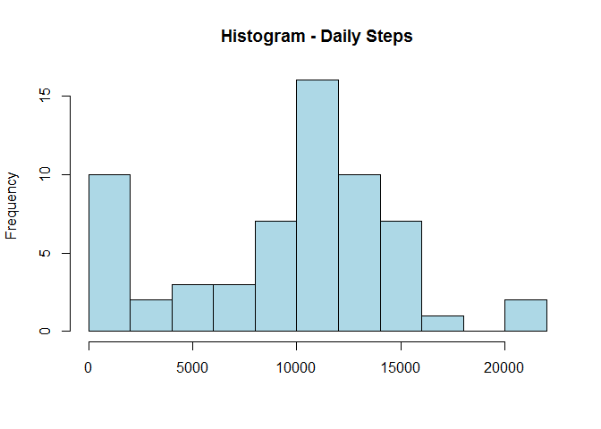
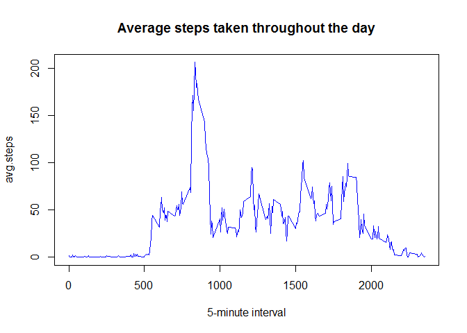
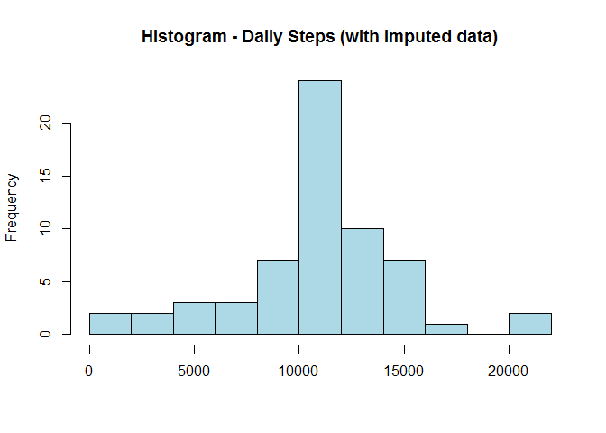
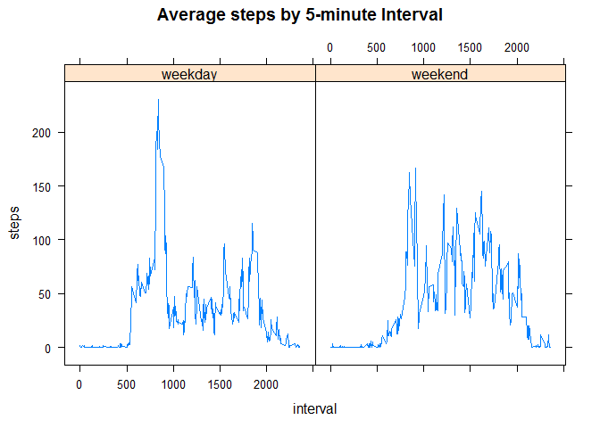

# Reproducible Research: Peer Assessment 1
### Loading and pre-processing the data


```r
        # load libraries
        library(lattice)

        # set working directory
        directory <- "H:/Coursera/Reproducible Research/"
        setwd(paste(directory,"RepData_PeerAssessment1/", sep=""))
        
        # Read-in Personal Activity Data
        data <- read.table(unz("activity.zip", "activity.csv"), sep=",", header=TRUE)
```
  
### What is the mean total number of steps taken per day?


```r
        # Compute number of steps taken per day
        daily <- with(data, tapply(steps, date, sum, na.rm=TRUE))
        daily <- data.frame(date=names(daily), steps = daily) # convert to data frame
        
        # Plot histogram of steps-per-day
        hist(daily$steps, breaks=10, col="light blue", main="Histogram - Daily Steps", xlab="")
```



```r
        # Report the mean/median steps per day
        mean(daily$steps, na.rm=TRUE)
```

```
## [1] 9354.23
```

```r
        median(daily$steps, na.rm=TRUE)
```

```
## [1] 10395
```

* *The subject takes an average of 9,354 steps-per-day*
* *The median number of steps-per-day is slightly higher than average, at 10,395 steps.*  
  
### What is the average daily activity pattern?


```r
        # Compute average number of steps, by 5-minute interval
        interval <- with(data, tapply(steps, as.factor(interval), mean, na.rm=TRUE))
        interval <- data.frame(interval=names(interval), avg.steps=interval) # convert to data frame
        interval$interval <- as.numeric(as.character(interval$interval)) # convert interval back to integer
        
        # Plot average steps taken over 5-minute intervals throughout the day
        with(interval, plot(interval, avg.steps, type="l", col="blue", 
                main="Average steps taken throughout the day", xlab="5-minute interval"))
```



```r
        # Report interval with max steps per day
        interval[interval$avg.steps==max(interval$avg.steps),1]
```

```
## [1] 835
```

* *On average, the subject takes the most steps between 8:30-8:35 AM*  

### Imputing Missing Values


```r
        # Compute number of missing obs
        sum(is.na(data$steps))
```

```
## [1] 2304
```

* *There are a total of 2,304 missing observations in the dataset.*
* We will impute these missing values using the mean for that 5-minute interval.


```r
        # Impute missings using mean of that 5-minute interval
        dataImputed <- merge(x=data, y=interval, by="interval", all.x=TRUE) # join with interval means
        # Replace NAs with mean
        for (i in 1:nrow(dataImputed)) {

                if(is.na(dataImputed$steps[i])) {
                        dataImputed$steps[i] <- dataImputed$avg.steps[i]
                }
        }
        dataImputed <- dataImputed[order(dataImputed$date, dataImputed$interval),] #sort
        
        # Compute number of steps-per-day (with imputed data)
        dailyImputed <- with(dataImputed, tapply(steps, date, sum, na.rm=TRUE))
        dailyImputed <- data.frame(date=names(dailyImputed), steps = dailyImputed)
        hist(dailyImputed$steps, breaks=10, col="light blue", main="Histogram - Daily Steps (with imputed data)", xlab="")
```



```r
        # Report mean/median steps-per-day (with imputed data)
        mean(dailyImputed$steps)
```

```
## [1] 10766.19
```

```r
        median(dailyImputed$steps)
```

```
## [1] 10766.19
```

* *When replacing missing values with the mean of that 5-minute interval, the average number of steps-per-day increases from 9,354 to 10,766. 
* *Similarly, the median number of steps-per-day increases from 10,395 to 10,766.
* *When imputing missing values with the average values of that interval, the total daily number of steps goes up.  

### Are there differences in activity patterns between weekdays and weekends?


```r
        # create factor variable for weekday/weekend
        dataImputed$date.d <- as.Date(as.character(data$date), "%Y-%m-%d") # convert to date class
        weekend <- dataImputed[weekdays(dataImputed$date.d) %in% c("Saturday","Sunday"),] # subset for weekends
        weekend$day <- "weekend"               
        
        weekday <- dataImputed[weekdays(dataImputed$date.d) %in% 
                        c("Monday","Tuesday","Wednesday","Thursday","Friday"),] # subset for weekdays
        weekday$day <- "weekday"
        dataImputed <- rbind(weekend,weekday) # combine weekends & weekdays
        
        
        # Compute average steps-per-interval (weekdays vs. weekends)
        dataImputed$id <- paste(as.character(dataImputed$interval), dataImputed$day, sep=".")
        dailyType <- with(dataImputed, tapply(steps, id, mean, na.rm=TRUE))
        dailyType <- data.frame(id=names(dailyType), steps=dailyType) # convert to data frame
        
               # Split ID into interval and weekday/weekend
                dailyType$id <- as.character(dailyType$id)
                dailyType$interval <- sapply(strsplit(dailyType$id, ".", fixed=TRUE), "[", c(1))
                dailyType$day <- sapply(strsplit(dailyType$id, ".", fixed=TRUE), "[", c(2))
                dailyType <- dailyType[, -c(1)]
                
                # Convert interval back to integer, sort
                dailyType$interval <- strtoi(dailyType$interval)
                dailyType <- dailyType[order(dailyType$interval),]
        
        # Plot average steps-per-interval (weekdays v. weekend)
        xyplot(steps ~ interval | day, data=dailyType, type="l", main="Average steps by 5-minute Interval")
```



